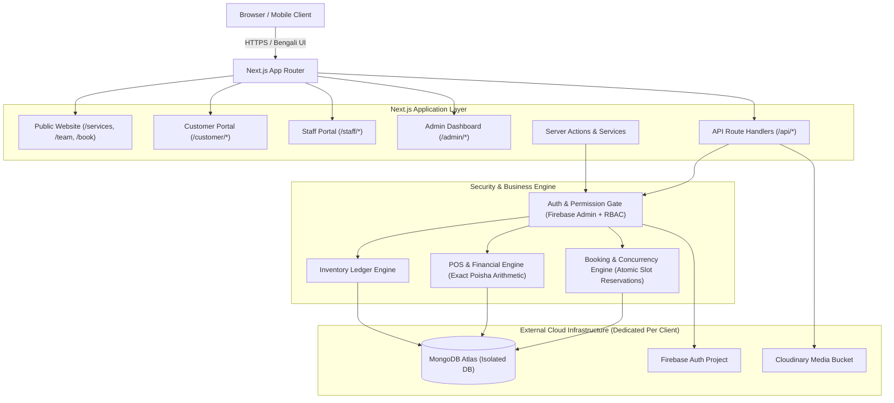

# Salon Booking & Management System - Architecture Guide
**Developed by Aulad IT Solution**

## 1. Architectural Philosophy
This application is designed as a **single-tenant master commercial codebase**. Rather than adopting multi-tenant architecture with shared databases and tenant discriminator columns, each salon client receives an entirely independent physical deployment.

### Single-Tenant Isolation Guarantees:
- **Zero Cross-Client Risk:** Client A's data, customer PII, financial ledgers, and staff logs never co-mingle with Client B's.
- **Dedicated Security Boundaries:** Every deployment has its own MongoDB Atlas database, Firebase Authentication realm, Cloudinary bucket, and environment variables.
- **Independent Scalability:** Salon instances scale on Vercel and MongoDB Atlas based on their own client traffic and peak hours without affecting other salons.
- **Customizable Business Rules:** Each instance can configure distinct booking intervals, currency rules, commissions, and visual branding in their own database.

---

## 2. Technology Stack & Design Decisions

### Core Application Framework
- **Next.js 15 (App Router):** Leverages React Server Components (RSC) for initial page loads, SEO optimization, and zero-JS public renders, combined with client components for interactive booking wizards, POS terminals, and calendar boards.
- **TypeScript (Strict Mode):** Type-safety across domain models, API payloads, financial calculations, and state machines.
- **Tailwind CSS & shadcn/ui Inspired Design:** Clean, modern, accessible UI with rich Bengali typography (**Hind Siliguri** font from Google Fonts), smooth transitions, glassmorphic accents, and responsive layout for mobile, tablet, and desktop POS screens.

### Data Layer
- **MongoDB Atlas with Mongoose:**
  - Optimized connection pooling for serverless environments.
  - Multi-document ACID transactions for booking reservations and POS checkouts.
  - Compound indexes for conflict-free slot reservations (`staffId + date + slotTime`).
  - Integer poisha representation (`priceMinor`) for zero floating-point roundoff issues.

### Identity & Access Management (IAM)
- **Firebase Authentication + Firebase Admin SDK:**
  - Public/Client: Google Sign-In and Email/Password sessions handled safely via Firebase Client SDK.
  - Server: Every protected route verifies the Firebase ID token or server-side session using Firebase Admin SDK.
  - Role-Based Access Control (RBAC): Centralized server-side permission verification mapping roles (`owner`, `manager`, `receptionist`, `staff`, `customer`, `guest`) to fine-grained permission flags.

### Media & Asset Storage
- **Cloudinary:**
  - Signed server-side uploads for salon logos, banners, service illustrations, staff avatars, and expense receipts.
  - Automatic format optimization (`f_auto`, `q_auto`) and responsive image delivery via `next/image`.

---

## 3. High-Level System Architecture

---

## 4. Key Subsystems

### 4.1. Concurrency-Safe Booking Engine
- Prevents double-booking at the database level.
- Generates 15/30-minute atomic slots based on salon operating hours, staff shifts, holidays, approved leaves, and service buffer times.
- Atomic reservations with unique index locks ensure that two customers cannot reserve the same stylist and slot simultaneously.

### 4.2. Point of Sale (POS) & Financial Engine
- Line-item calculations with validated integer poisha units (1 Taka = 100 Poisha).
- Split payment support (Cash, bKash, Nagad, Rocket, Bank Transfer, Card).
- Atomic sequential invoice numbering via concurrency-safe atomic counters.
- Automatic inventory depletion for retail items and staff commission calculations.

### 4.3. Localization Architecture
- Dedicated centralized dictionary in `src/i18n/bn.ts`.
- Consistent Bengali numerals, currency display (৳), date formatting (`date-fns/locale/bn`), and localized form validation error messages.
