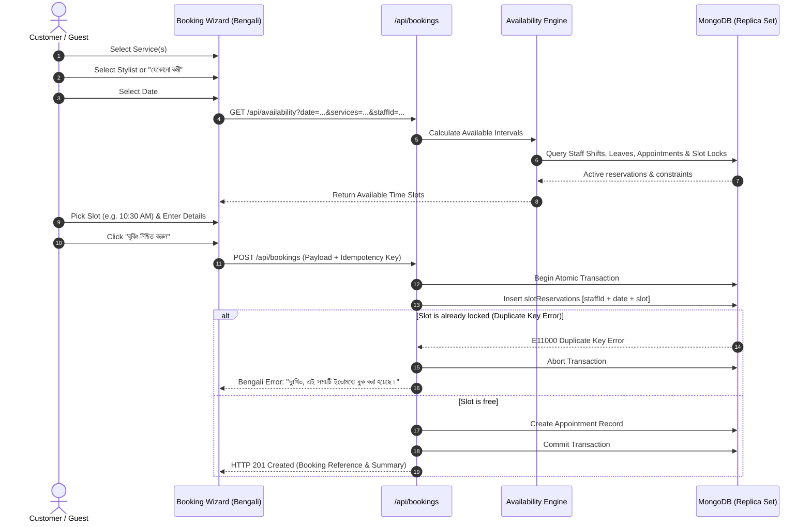

# Booking Engine Architecture & Concurrency Control
**Salon Booking & Management System - Aulad IT Solution**

## 1. Booking Workflow
The appointment booking engine is designed for customer ease and bulletproof concurrency protection.



---

## 2. Slot Calculation Algorithm
An interval slot `T` (e.g., `10:00 - 10:45`) is marked available if and only if **all** of the following conditions evaluate to true:

1. **Salon Opening Hours:** `T.start >= business.openingTime` and `T.end <= business.closingTime`.
2. **Weekly Holiday Check:** `DayOfWeek(date)` is not in `business.weeklyHolidays`.
3. **Staff Shift Hours:** For assigned staff member, `T.start >= staff.shiftStart` and `T.end <= staff.shiftEnd`.
4. **Staff Weekly Holidays:** `DayOfWeek(date)` is in `staff.workingDays`.
5. **Staff Approved Leave:** Staff has no approved leave covering `date`.
6. **No Overlapping Appointments:** No existing appointment for `staffId` overlaps with `[T.start - bufferBefore, T.end + bufferAfter]`.
7. **No Slot Reservation Conflict:** No active record in `slotReservations` for `staffId`, `bookingDate`, and `T.slotTime`.
8. **Cutoff Policy:** `T.start` is at least `business.bookingCutoffHours` in advance of current UTC/Dhaka time.
9. **Advance Window:** `date` is within `business.maxAdvanceDays`.

---

## 3. Concurrency Protection Details
In high-volume booking environments, two customers may select the same time slot at the same second. Client-side checks alone are insufficient.

### Prevention Architecture:
1. **The `slotReservations` Collection:**
   ```typescript
   slotReservationSchema.index(
     { staffId: 1, bookingDate: 1, slotTime: 1 },
     { unique: true }
   );
   ```
2. For an appointment lasting 60 minutes with 15-minute intervals, multiple reservation records are generated:
   - `10:00`, `10:15`, `10:30`, `10:45`
3. All records are inserted atomically within a MongoDB session/transaction.
4. If another concurrent request has inserted any of those slots, MongoDB triggers an immediate `11000` duplicate key violation. The transaction rolls back cleanly, preventing partial writes and double bookings.
5. When an appointment is rescheduled or cancelled, its reservation records are deleted, freeing up the slots immediately.

---

## 4. State Machine Transitions

| Current Status | Allowed Next Statuses | Actor |
|---|---|---|
| `pending` | `confirmed`, `cancelled` | Admin, Receptionist, Customer |
| `confirmed` | `checked_in`, `cancelled`, `no_show` | Receptionist, Admin |
| `checked_in` | `in_progress`, `cancelled`, `no_show` | Staff, Receptionist, Admin |
| `in_progress` | `completed` | Staff, Receptionist, Admin |
| `completed` | *Final State (Immutable)* | - |
| `cancelled` | *Final State (Immutable)* | - |
| `no_show` | *Final State (Immutable)* | - |
