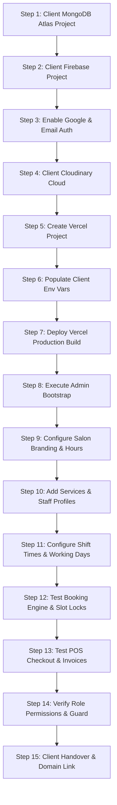

# Client Deployment Guide
**Salon Booking & Management System - Aulad IT Solution**

## 1. Single-Tenant Deployment Process (Step-by-Step)

Aulad IT Solution provisions a dedicated production instance for each salon client following this 15-step checklist.



### Step 1: Create Client-Owned MongoDB Atlas Database
1. Create a dedicated organization and project named `<ClientSalonName>`.
2. Provision a M0 (development) or M10+ (production dedicated) cluster with replica sets.
3. Configure Network Access: Allow Vercel IPs (`0.0.0.0/0` with strong password authentication).
4. Create a database user with `readWriteAnyDatabase` privileges.
5. Save the SRV connection URI.

### Step 2: Create Client-Owned Firebase Project
1. Go to console.firebase.google.com and create `<client-salon>`.
2. Navigate to Authentication > Sign-in method:
   - Enable **Google** provider.
   - Enable **Email/Password** provider.
3. Add Authorized Domains: Include `<client-salon>.vercel.app` and client's custom domain (e.g. `www.glamoursalonbd.com`).
4. Under Project Settings > Service accounts, click **Generate new private key**. Save the JSON file securely.

### Step 3: Create Client Cloudinary Media Environment
1. Create a dedicated Cloudinary environment or separate cloud name for the client.
2. Under Settings > Upload, create an upload preset or configure server-side signed uploads.
3. Note `CLOUDINARY_CLOUD_NAME`, `CLOUDINARY_API_KEY`, and `CLOUDINARY_API_SECRET`.

### Step 4: Provision Vercel Project
1. Link the repository `auladit/salon-booking-management-system` in Vercel.
2. Configure Environment Variables for Production & Preview using the client's values.
3. Deploy the project.

### Step 5: Execute Administrator Bootstrap
Invoke the bootstrap endpoint:
```bash
curl -X POST https://client-salon.vercel.app/api/admin/bootstrap \
  -H "Content-Type: application/json" \
  -d '{"secretKey": "<YOUR_BOOTSTRAP_SECRET_KEY>"}'
```
Log in using the bootstrap admin email, update password, and test dashboard access.

---

## 2. Infrastructure Cost Breakdown

| Component | Free Tier Feasibility | Recommended Production Tier | Estimated Cost |
|---|---|---|---|
| **MongoDB Atlas** | M0 Free (512MB, Shared) | M10 Dedicated (Replica Set, Auto-backups) | ~$57 / month |
| **Firebase Auth** | 50,000 monthly active users free | Blaze (Pay-as-you-go) | Free to ~$5/mo |
| **Cloudinary** | 25 monthly credits free (~25GB storage/bandwidth) | Plus plan if high volume | Free to ~$89/mo |
| **Vercel** | Hobby (Non-commercial) | Vercel Pro (Commercial license required) | $20 / seat / month |
| **Custom Domain** | N/A | .com / .com.bd domain | ~$10 - $25 / year |
